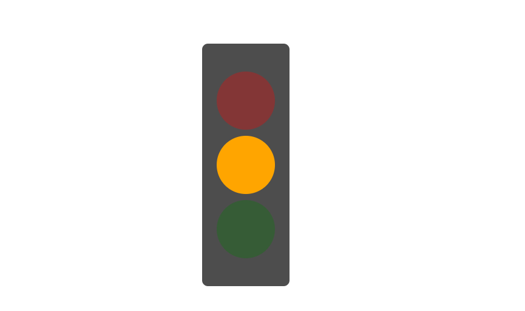

# Traffic Light with Javascript DOM

This project focuses on creating a traffic light simulation using HTML, CSS, and JavaScript. The initial version uses DOM manipulation to control the lighting sequence of red, yellow, and green lights with set durations (3 seconds, 2 seconds, 3 seconds) using setTimeout for precise timing. The project utilizes CSS opacity to differentiate between "on" (bright) and "off" (dim) states, maintaining the default colors (red, orange, green). The layout is styled with flexbox for centered, responsive alignment across devices. The JavaScript logic ensures a continuous cycle of the traffic light sequence.

## Preview



## Getting Started
1. Clone this project:
```
git clone https://github.com/ranandasatria/fgo24-dom-traffic-light
```

2. Install the depedencies:
```
npm install
```

3. Run the project:
```
npm run dev
```

4. The project will be runnning at:
``` 
http://localhost:8080
```

## Depedencies

This project uses Node.js. Make sure you have Node.js installed on your machine.

- live-server: to simulate an HTTP server in a local environment.

## How to contribute

Please open a Pull Request (PR) to contribute to this project.
Your PR will be reviewed and merged if necessary.

## License

This project following MIT License.

## Copyright
&copy; 2025 Kodacademy


